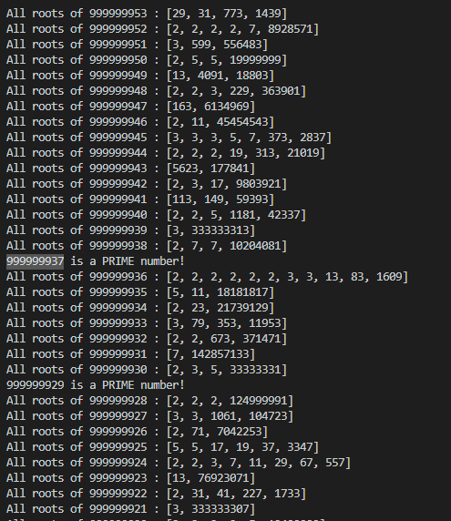
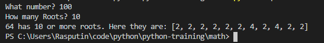

# Small Python Scripts

Some hand-written python scripts.

## Math

* factorFinder: takes in user input and returns IF the value is PRIME. If NOT PRIME, returns array of all factors.

* primeFinder: takes in user input and returns array of all PRIMES from 1 to user input.

* factorOfFactor: takes in user input, gets list of all factors, and for each factor, replaces the factor with an array of factors for that factor

* primeRoots: delivers a list of all roots of a given value

* primeRootsLooper: loops over primeRoots (same functionality, not imported) from a user input value to 1, showing hte roots of each value or if that value is a prime

* primeRootsLooperFaster: adds a step to previous version. First, it goes from 1 to chosen value. It loggs all primes as it goes. It uses the arr of primes before moving to process in previous version. Previous version improved further by cutting checked vals by 2.

* primeRootsCounter: same as above, however takes in user defined root-count and displays all vals with a number of roots >= to the specified value.

